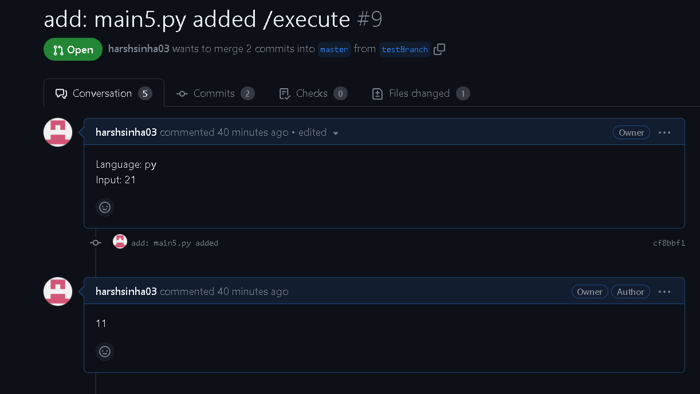
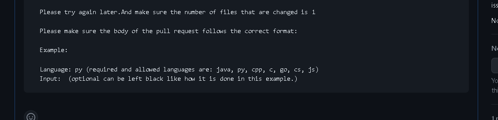

# CodeWhizard

Click Here for Documentation: [docs](/DOCUMENTATION.md)
----------------
Click Here for Demo:[link](https://drive.google.com/file/d/1ClO2ucNySe2ChxjtfV3lhxDOL24wXL3_/view?usp=sharing)
----------------
# Summary (Detailed information about the project is provided after the results section)

### Project Overview
----------------

The goal of this project was to create a GitHub application using Probot and integrate it with CodeX-API to execute code in response to pull requests. The application would validate the pull request, extract code, execute it, and generate comments with the output or appropriate error messages.

### How to use it 

1. Clone this repository in an empty directory
   ```
    git clone https://github.com/harshsinha03/CodeWhizard.git
   ```
2. Go to the repository's folder
   ```
    cd CodeWhizard
   ```
3. Now install all the dependencies
   ```
    npm i
   ```
4. Setup your .env file with these details
   `1. WEBHOOK_PROXY_URL:Go to https://smee.io/new set this to the URL that you are redirected to.`
    `2. APP_ID`
    `3. WEBHOOK_SECRET`
    `4. GITHUB_TOKEN`
5. Configure the github app to your profile and allow the necessary permissions: use this link [CodeWhizard](https://github.com/apps/codewhizard)
6. Set up the webhooks for the repository you want to use the bot in and for that refer [docs](/DOCUMENTATION.md)
7. Start your application and enjoy:
   ```
    npm start or npm run start
   ```
### Results:
----------------
#### Success ( When the language and input are mentioned and /executed command is given ) : 

----------------
#### Error ( When the disclaimer given below is not followed properly ): 

----------------

*Disclaimer:*
----------------
It is essential to follow the guidelines mentioned below to ensure the proper functioning of the code:

Timing: If you encounter any issues with the code execution, please try again later as there may be temporary server or network issues affecting the execution.

File Changes: The code is designed to handle pull requests with a single file change. Multi-file changes are currently not supported.

Correct Pull Request Format: To ensure successful code execution, please make sure the body of your pull request follows the correct format. The format should be as follows:

Example:
`Language: py (required and allowed languages are: java, py, cpp, c, go, cs, js)
Input: (optional - can be left blank)`

It is important to provide the language used in your code (e.g., py for Python) and, if applicable, any input required for the code execution.

When creating a pull request it is mandatory to fill both title and body for the bot to work as the bot needs the parameters in the body for execution and the command */execute* can be written in title as well as body they will both be considered.

#### **Title of the Pull Request:** [Provide a meaningful title for your pull request]

#### **Body of the Pull Request:** [Follow the correct format mentioned above]


## Project Details
---------------

### Environment Setup
-----------------
The project started by setting up the necessary dependencies, including Probot, axios, and qs. These libraries provided the required functionality for GitHub integration and making API requests.

### GitHub App Integration
----------------------
A GitHub App was created and configured with the necessary permissions. This allowed the Probot application to interact with GitHub repositories and listen to specific events, such as `pull_request`.

### Pull Request Event Handling
---------------------------
Event handlers were implemented for relevant pull request events, including `pull_request.opened`, `pull_request.synchronize`, and `pull_request.edited`. These event handlers processed the pull requests and triggered code execution based on specific conditions.

### Pull Request Validation
-----------------------
Validation checks were added to ensure that the pull request met specific criteria before executing the code. This included verifying the presence of the "/execute" command in the pull request title or body. Additionally, it was ensured that the number of changed files in the pull request was limited to one to handle single-file execution.

### Code Extraction
---------------
Logic was developed to extract the code from the pull request. The GitHub REST API was used to retrieve the content of the file associated with the pull request, ensuring that only a single file was considered for code execution.

### Code Execution
--------------
The CodeX-API was integrated for executing the extracted code. Using the axios library, a POST request was made to the CodeX-API endpoint, passing the code, language, and input parameters. The response from the API provided the output of the code execution.

### Comment Generation
------------------
A module was implemented to generate comments based on the code execution results. The Octokit library was used to create a comment on the pull request using the GitHub REST API. The comment included the code output or appropriate error messages.

### Error Handling
--------------
Error handling mechanisms were incorporated to handle exceptions or errors that might occur during code execution or comment generation. Clear error messages were provided to users in case of failures, ensuring effective communication and troubleshooting.

### Deployment and Testing
----------------------
The GitHub application was deployed, and comprehensive testing was performed to validate its functionality. Pull requests with the required format were created and tested to ensure that the application correctly executed the code and generated comments with the expected output.

### Additional Notes
----------------
The current implementation supports handling only single-file changes in pull requests. However, the application can be enhanced in the future to handle multi-file changes and accommodate more complex scenarios.

### Technologies Used
-----------------
- Probot: A framework for building GitHub Apps with Node.js
- GitHub REST API (via Octokit): Used for interacting with GitHub repositories and creating comments
- CodeX-API: Integrated for code execution
- Axios: A library for making HTTP requests
- qs: A library for serializing and parsing URL query strings
- diff: A javascript text differencing implementation.

The project followed best practices to ensure secure and efficient code execution within the GitHub environment.

Overall, the GitHub application successfully executes code based on specific commands in pull requests and provides feedback through comments. It can be further customized and expanded based on specific requirements and use cases.

### Contributing

If you have suggestions for how CodeWhizard could be improved, or want to report a bug, open an issue! We'd love all and any contributions.

For more, check out the [Contributing Guide](CONTRIBUTING.md).

## License

[ISC](LICENSE) © 2023 harsh
=======
# CodeWhizard
A Github App that gives the output of the code to users upon creating pull requests
>>>>>>> origin/master
